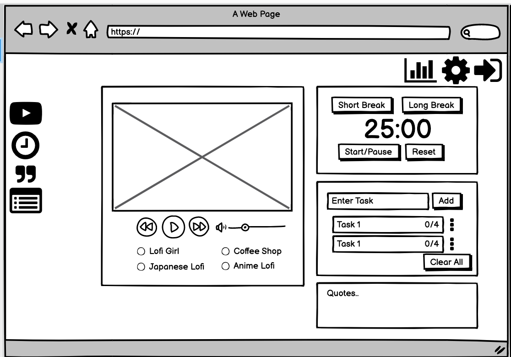
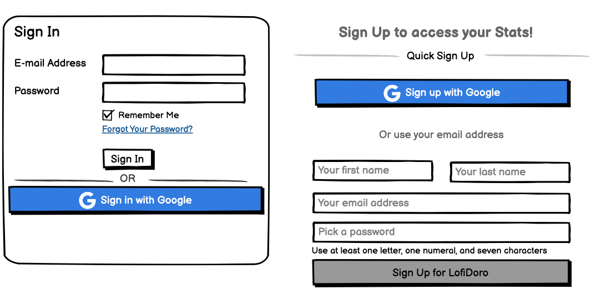
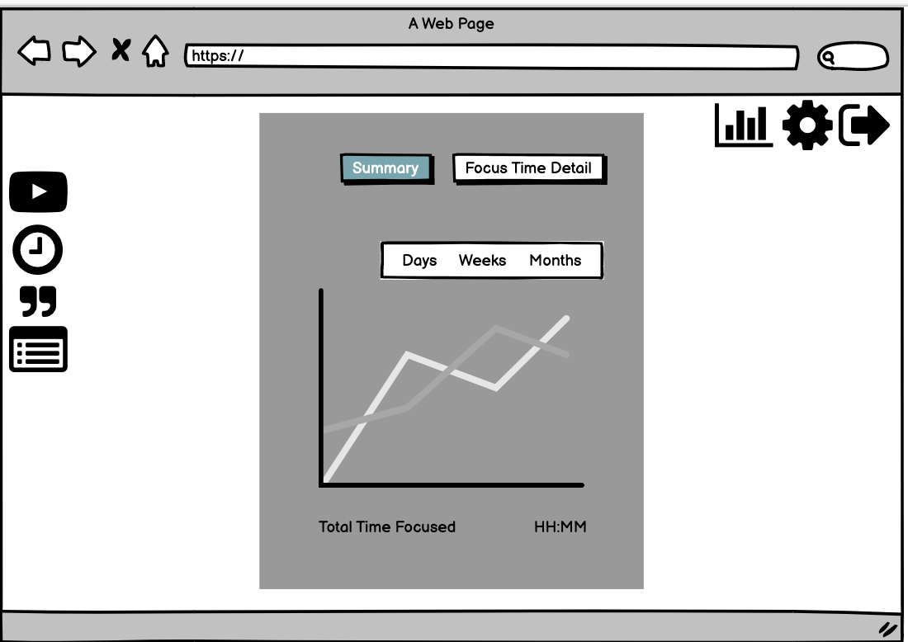
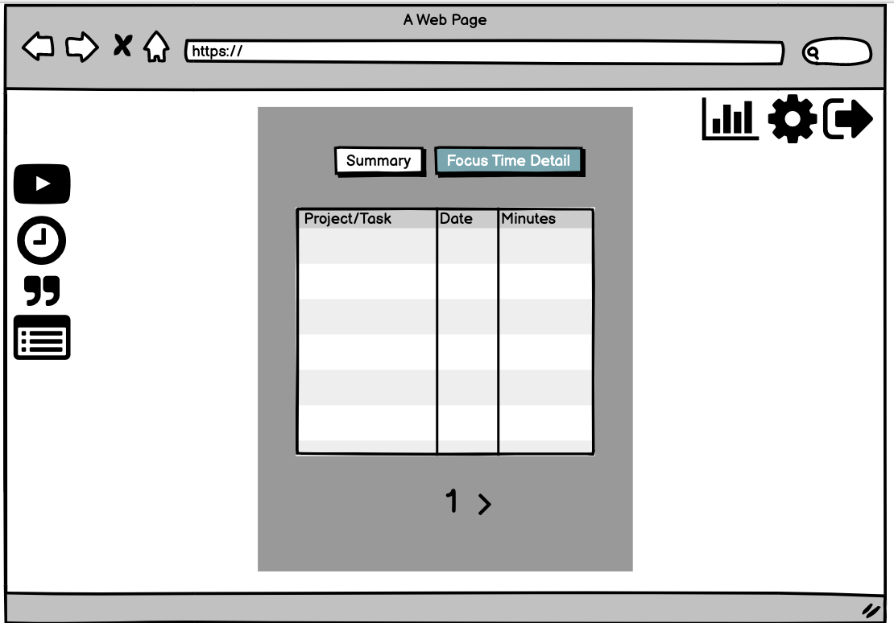

# Lofi Pomodoro

## Getting Started

1. Install yarn. `npm install -g yarn`
2. `yarn install`
3. `yarn dev`

### Hosting

1. `npm install -g firebase-tools`
2. `firebase login`
3. `yarn deploy`

### Stuck?

Try This

1. Navigate to: <https://console.firebase.google.com/> (make sure you are using the same account as you used for login)
1. Open your project, and navigate to 'Project Overview > Project settings'
1. Scroll down to 'Your apps' section and click on the web-app symbol (</>)
1. Follow the prompts and in the 2nd step, copy down the `const firebaseConfig` section as you will need it soon
1. Navigate to 'Build > Authentication', click 'Get started', and then follow the prompts to setup 'email/password' and 'Google' providers
1. Navigate to 'Build > Firestore Database', click 'Create database', and select 'Start in test mode'
1. Navigate to 'Build > Storage', click 'Get started', and select 'Start in test mode'
1. In the root folder, **copy** `env.local.example` and rename to `env.local` and open it
1. Enter the `authDomain`, `apiKey`, `projectId`, `storageBucket` into `env.local` to their respective variables
1. `yarn dev`
1. Once you can run locally, run `yarn deploy`

<!---
*** WHEN YOU ARE UP AND RUNNING, DELETE EVERYTHING ABOVE ME EXCEPT THE VERY TOP LINE. ***
*** RENAME THE TOP LINE WITH YOUR PROJECT NAME. ***
-->

## Sprint Progress

Update your progress by checking off the tasks for each sprint. We will **not** be using issues for solo projects.

### Sprint 1

- [x] Get app approved (DM Scott for approval)
  - [x] Add project description to bottom of this page
- [x] Create mockups (physical paper, low-fi)
  - [x] Attach mockups to bottom of this page
- [x] Define scope (DM Scott for approval)
  - [x] Define milestones for each sprint
  - [x] Define final deliverable for v1
- [ ] App must
  - [ ] Be publicly accessible
  - [x] Have working authentication
  - [ ] Have technical component 5% done
    - [ ] Create components to hold the different features (pomodoro timer, task tracker, daily quotes, youtube player)
    - [ ] Create button to show and hide the different widgets

### Sprint 2

- [ ] Technical component 25%
- [ ] Complete pomodoro timer, task tracker, daily quotes
- [ ] Use youtube api to create the youtube player
- [ ] Create the sign up/login page

### Sprint 3

- [ ] Technical component 50%
- [ ] Re-evaluate milestones and features
- [ ] Make windows draggable using react-draggable package
- [ ] Creating the stats page for time focused on day/week period 

### Sprint 4

- [ ] Technical component 100%
- [ ] Add settings to pomodoro timer and dark/light theme of the layout
- [ ] Add the stats setting, complete the ui for displaying the stats on the summary/detail page
- [ ] Add feature to change backgrounds from set of backgrounds available (scrolling through/ dropdown menu)

## Project Overview

### Description

A pomodoro timer that plays lofi from youtube lofi livestreams while you study or work. Some features included is a task tracker, motivational quotes to keep you motivated, and a report of time focused and tasks completed using the app. 

### Mockups

|  |  |
|----------------------------------------------------------------------|----------------------------------------------------------------------|
|  |  |
